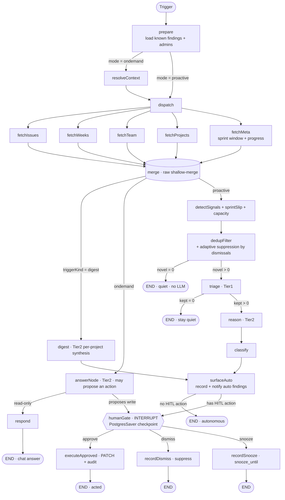

# FleetGraph

A project-intelligence agent embedded in **Ship**. It reads the live state of a project, reasons
about what's wrong and what's next, and acts — **proactively** (pushes findings with no user present)
and **on-demand** (context-aware chat scoped to the view you're looking at). Both modes run through
**one LangGraph.js graph**; the only difference is the trigger.

- **Framework:** LangGraph.js (`@langchain/langgraph`) running inside Ship's Express API (`api/src/fleetgraph/`).
- **Model:** Claude via AWS Bedrock (`@langchain/aws` `ChatBedrockConverse`) — reuses Ship's existing
  Bedrock posture (IAM instance role, no new key). Tiered: Haiku (triage) / Opus (reason, answer).
- **Observability:** LangSmith tracing (auto via LangGraph when `LANGCHAIN_TRACING_V2=true`).
- **Persistence:** Postgres-backed checkpointer (`@langchain/langgraph-checkpoint-postgres`) so
  interrupted human-in-the-loop runs survive deploys/scale-in; one `fleetgraph_findings` table is the
  cross-run dedup memory; `fleetgraph_pending_approvals` projects paused runs into the inbox.

---

## Agent Responsibility

**What it monitors proactively.** Issue state across the workspace's open work. Today's detectors
(`api/src/fleetgraph/detectors.ts`) flag:
- **Stale in-progress** — `state=in_progress` with no activity (no `document_history` row / `updated_at`)
  for ≥ N days (`FLEETGRAPH_STALE_DAYS`, default 3).
- **Overdue** — `due_date < today` and not `done`/`cancelled`.
- **Unassigned** — open work (`todo`/`in_progress`/`in_review`) with no `assignee_id`.
- **Unestimated** — open work with no `estimate`.

**What it reasons about on demand.** Whatever the user is looking at. The embedded chat answers
questions about the current issue / week / project ("What's at risk here?", "Who's overloaded?",
"Is this week on track?") grounded in the same fetched state, and can suggest the next action.

**What it can do autonomously (no approval).** Additive, reversible things only: record a finding,
push an in-app notification, surface a flag in the inbox, write a `document_history` audit row, and
answer chat questions. These never change the system of record.

**What always requires human approval (HITL).** Any mutation of authoritative project state:
issue `state` / `priority` / `assignee_id` / `estimate` / `due_date`, plan/retro/approval edits,
sprint `confidence`, project ICE — and anything that would notify another person (reassignment,
escalation). The gate is enforced in depth: the agent's write path only ever touches Ship's
Zod-validated fields, and every write it makes is stamped `automated_by='fleetgraph'` for instant
audit and rollback. Current HITL actions: **move stalled work back to To Do** and **raise an overdue
issue to Urgent** — both proposed, never applied without a click.

**Who it notifies, and when.** Findings/approvals are pushed over Ship's existing `/events`
WebSocket (`broadcastToUser`) to the issue's **assignee** when set; otherwise to **workspace admins**
as a fallback. Notifications fire only for *novel* findings (see dedup), so the agent stays quiet
when nothing has materially changed.

**How it knows who is on a project / their role.** From Ship's real model: `person` documents
(`properties.user_id`, `role`, `capacity_hours`, `reports_to`), the `assignee_id` on issues, sprint
`owner_id`, project `owner_id`/`accountable_id` (RACI), and `workspace_memberships.role`
(`admin`/`member`). The agent authenticates with no user session via a Bearer API token when needed;
in-process it queries the same DB pool directly.

**How on-demand mode uses the current view.** The chat reads `useCurrentDocument()` on the client
and passes `{ documentId, documentType, projectId, sprintId }` to the graph. `resolveContext`
expands that into the concrete entity set (an issue → that issue; a sprint → that sprint's issues),
so a chat on an issue knows that issue and a chat on a week knows that week.

---

## Graph Diagram

One graph, both modes. Node names match `api/src/fleetgraph/graph.ts`.



> Evals: `pnpm fleetgraph:eval` scores the deterministic detectors against labeled cases
> (precision / recall / quiet-accuracy) — currently 10/10 exact. See `api/src/fleetgraph/evals/`.

### Node types
- **Context:** `prepare` (load dedup baseline + admins), `resolveContext` (on-demand scope expansion).
- **Fetch (parallel, read-only):** `fetchIssues`, `fetchWeeks`, `fetchTeam`, `fetchProjects` → `merge`
  (the `raw` channel shallow-merges the four, so fan-in is order-independent).
- **Reasoning:** `detectSignals` (deterministic), `dedupFilter` (deterministic), `triage` (Tier-1 Haiku),
  `reason` (Tier-2 Opus), `answerNode` (Tier-2, on-demand).
- **Action:** `classify` (auto vs HITL policy), `surfaceAuto` (persist + notify autonomous findings),
  `humanGate` (`interrupt()`), `executeApproved`, `recordDismiss`, `recordSnooze`.
- **Output:** `respond` (chat), plus the notify/persist side-effects in `surfaceAuto`/`executeApproved`.

### Edges & branching conditions
| From | Condition | To |
|---|---|---|
| `prepare` | `mode === 'ondemand'` | `resolveContext` → `dispatch` |
| `prepare` | `mode === 'proactive'` | `dispatch` |
| `merge` | `mode === 'ondemand'` | `answerNode` → `respond` → END |
| `merge` | `mode === 'proactive'` | `detectSignals` |
| `dedupFilter` | `novelSignals.length === 0` | END (quiet, **no LLM**) |
| `dedupFilter` | `novelSignals.length > 0` | `triage` |
| `triage` | `keptSignals.length === 0` | END (stay quiet) |
| `triage` | `keptSignals.length > 0` | `reason` → `classify` → `surfaceAuto` |
| `surfaceAuto` | no HITL action | END (autonomous) |
| `surfaceAuto` | has HITL action | `humanGate` (interrupt) |
| `humanGate` | resume `approve` | `executeApproved` |
| `humanGate` | resume `dismiss` | `recordDismiss` |
| `humanGate` | resume `snooze` | `recordSnooze` |

### Distinct execution paths (for LangSmith trace evidence)
1. **Quiet** — proactive, dedup short-circuits → ends before any LLM call.
2. **Stay-quiet** — triage drops everything (Tier-1 only).
3. **Autonomous finding** — Tier-1 + Tier-2, posts + notifies, no interrupt.
4. **HITL approve** — pauses at `humanGate`, resumes, applies a PATCH.
5. **HITL dismiss / snooze** — pauses, resumes without mutating.
6. **On-demand read** — router → fetch → `answerNode` → `respond`.

---

## Use Cases

| # | Role | Trigger | Agent detects / produces | Human decides | Path |
|---|------|---------|--------------------------|---------------|------|
| 1 | Engineer | Proactive (cron / mutation): `in_progress` with no activity ≥ 3 days | "Stalled: #142" finding + proposes moving it back to To Do | Approve the state change / snooze / dismiss | HITL |
| 2 | PM | Proactive: open work with no assignee | "Unassigned: #X" flag in the inbox + notify admins | Assign it (in Ship) — agent doesn't pick an owner | Autonomous |
| 3 | PM | Proactive: open work with no estimate | "No estimate: #X" flag, notify assignee | Add an estimate | Autonomous |
| 4 | Engineer / PM | Proactive: `due_date < today`, still open | "Overdue: #X (N days)" + proposes raising to Urgent | Approve priority bump / re-date / dismiss | HITL |
| 5 | Any | On-demand: chat from an issue / week / project | Grounded answer ("What's at risk?", "Who's overloaded?", "Is this week on track?") + suggested next action | Whether to act on the suggestion | On-demand read |
| 6 | Director / PM | Proactive (cron): active sprint where elapsed-fraction outpaces done-fraction (worse if confidence high) | "At risk of slipping: Week N — 71% elapsed, 20% done" finding to the sprint owner | Cut scope / reset confidence | Autonomous |
| 7 | Manager | Proactive (cron): `Σ estimate` of a person's open work > `capacity_hours` | "Overloaded: Dana (34h vs 20h)" + proposes reassigning the lowest-priority item to the teammate with the most slack; notifies `reports_to` | Approve the reassignment / dismiss | HITL |
| 8 | Any | On-demand: chat requests a change ("reassign #142 to Dana", "bump #88 to urgent") | Proposes a concrete action with validated ids; surfaces an inline Apply/Cancel | Apply or cancel | On-demand action (HITL) |
| 9 | Director / PM | Proactive (daily cron): per project | Daily digest — "what's moving, what's at risk, the single most important next action" | Read; act on the called-out next step | Autonomous (digest) |
| 10 | Team | Repeatedly dismissing a finding type | Agent learns to suppress that type after N dismissals (adaptive) | Nothing — the noise stops | (suppression at dedup) |

---

## Trigger Model — **Hybrid** (event-hook + cron sweep)

Defended choice: webhook-only misses "nothing happened" conditions; poll-only wastes runs and couples
latency to the interval. Hybrid gets sub-minute latency on *changes* and bounded latency on *absences*.

- **Real-time (mutation):** an in-process event fires from the issue `PATCH` post-commit hook
  (`api/src/routes/issues.ts`), debounced ~15s (`FLEETGRAPH_DEBOUNCE_MS`) and run in the same process
  (no broker). Fetch (narrow, parallel) ≈ 0.5–2s · triage ≈ 1–3s · reason ≈ 3–8s · notify ≈ instant
  → **well under the 5-minute detection SLA** (typically < 1 min).
- **Scheduled (cron):** `node-cron` every 5 min (`FLEETGRAPH_CRON`) sweeps each workspace's open work
  to catch absence-class conditions (stale, overdue) that no mutation fires for. The interval *is* the
  latency for those classes → 5 min honors the SLA.
- **Horizontal-scale guard:** the sweep holds a `pg_try_advisory_lock`, so on a multi-instance EB
  fleet only one instance sweeps per tick.

**Cost & latency posture.** Most proactive runs end on the **quiet path with zero LLM tokens** because
`dedupFilter` short-circuits before any model call (the dominant case). Triage is batched on the cheap
tier; the expensive tier only sees triage survivors. Rough per-run budget: quiet = 0 · autonomous ≈
1–3k (T1) + 2–5k (T2) · HITL ≈ same + rationale (resume adds 0 model tokens) · on-demand ≈ 3–9k (T2).

---

## State Management
- **Within a run:** `raw` caches all parallel fetches (no re-fetch); `signals`/`findings` accumulate.
- **Between proactive runs:** `fleetgraph_findings` (`UNIQUE(workspace_id, dedup_key)`) is the memory.
  `dedupFilter` drops a signal whose row exists and whose `content_hash` is unchanged; it re-surfaces
  only when the situation materially worsens (hash changes) or a snooze expires. Dismissed findings are
  permanently suppressed.
- **Paused runs:** the LangGraph checkpoint (thread = `runId`) holds full state in Postgres; the
  `fleetgraph_pending_approvals` row lets the inbox list pending approvals and lets an approval landing
  on any instance rehydrate the right thread.

---

## Running it

```bash
# DB (local Postgres) up, then:
pnpm dev                 # starts api + web; FleetGraph triggers start with the API

# Required env for live reasoning + tracing (Bedrock uses the IAM role, no key):
#   LANGCHAIN_TRACING_V2=true
#   LANGCHAIN_API_KEY=ls__...
#   LANGCHAIN_PROJECT=fleetgraph
# Optional tuning:
#   FLEETGRAPH_STALE_DAYS=3   FLEETGRAPH_DEBOUNCE_MS=15000   FLEETGRAPH_CRON="*/5 * * * *"
#   FLEETGRAPH_MODEL_TIER1 / FLEETGRAPH_MODEL_TIER2   FLEETGRAPH_DISABLED=1
```

In the UI: the **bell** (bottom-right) opens the inbox (findings + approval cards with
Approve / Snooze / Dismiss); the **chat** button opens context-aware chat scoped to the current view.

---

## Test Cases  *(Early Submission — trace links added once `LANGCHAIN_API_KEY` is set)*

Verified end-to-end against real seeded Ship data (`api` + Postgres), no mocks:

| # | Ship state | Expected output | Status |
|---|-----------|-----------------|--------|
| 1 | Open issue with no `assignee_id` | `unassigned` finding (auto), in inbox + notify | ✅ verified |
| 2 | Open issue with no `estimate` | `unestimated` finding (auto) | ✅ verified |
| 3 | Issue `due_date` in the past, not done | `overdue` finding + **pending approval** to raise Urgent | ✅ verified |
| 4 | Approve the overdue action | `priority` PATCHed `→ urgent`, `document_history` row `automated_by='fleetgraph'`, approval resolved | ✅ verified |
| 5 | Run the sweep again, nothing changed | **0 new findings** (dedup idempotent) | ✅ verified |
| 6 | On-demand chat with `scope` from current view | grounded answer (Tier-2) returned to the panel | ✅ verified (LLM path; falls back gracefully if Bedrock unavailable) |

### LangSmith trace links (different execution paths)

| Path | What it exercises | Trace |
|------|-------------------|-------|
| On-demand chat | `router → resolveContext → fetch ×4 → answerNode → respond` | https://smith.langchain.com/public/11e35f97-9a7d-4cf5-a666-813f24a3db8e/r |
| Proactive HITL | `detect → dedup → triage → reason → classify → surfaceAuto → humanGate (INTERRUPT)` | https://smith.langchain.com/public/7c242ba9-4411-42ce-8f90-398fa9065180/r |
| Proactive quiet | `detect → dedup → END` (dedup short-circuit, no LLM) | https://smith.langchain.com/public/fa64325b-b50b-4780-b1ac-68854141b832/r |

Three visibly different graph shapes from the same graph under different conditions — a graph, not a
pipeline. Captured with real Claude reasoning (Anthropic API, `claude-sonnet-4-6` / `claude-haiku-4-5`)
and `LANGCHAIN_TRACING_V2=true`.

---

## Architecture Decisions
- **LangGraph.js over Python** — keeps the agent in Ship's TS monorepo; still LangGraph, so LangSmith
  tracing is automatic and the "LangGraph recommended" constraint is met. Reuses Ship's API, types,
  auth, WebSocket, and toast.
- **Bedrock over the first-party Anthropic API** — reuses Ship's in-prod Bedrock integration; IAM
  auth, no new secret. LangSmith still captures token usage.
- **Postgres checkpointer over MemorySaver** — EB is multi-instance/ephemeral; in-memory state would
  lose interrupted HITL runs on deploy and break cross-instance resume.
- **Hybrid trigger over poll-only/webhook-only** — see Trigger Model.
- **In-process runner over a separate worker/broker** — one deploy, one secret store; debounced queue
  + advisory-locked cron are enough at this scale.
- **Deterministic detectors before any LLM** — the biggest cost lever; reasoning only runs on novel,
  triage-surviving signals.
